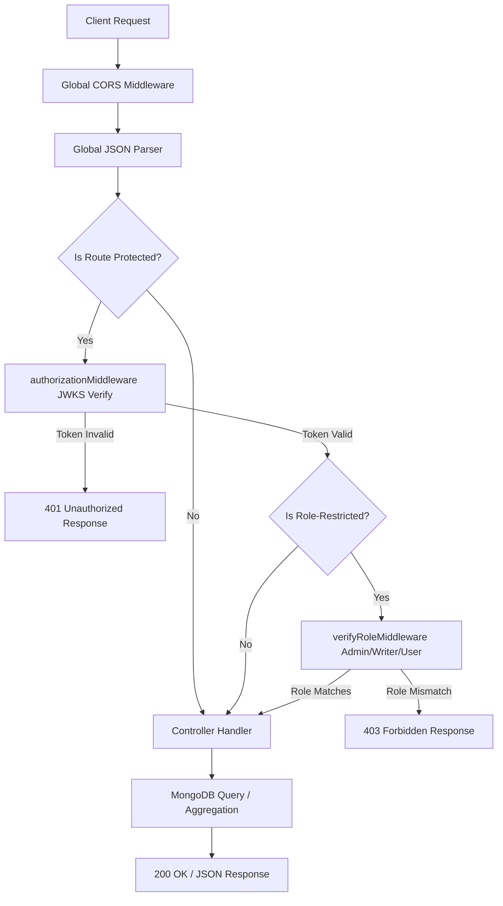

# Fable Server

A secure, high-performance REST API powering the Fable eBook sharing platform, featuring role-based access control, content protection, and advanced aggregation pipelines.


---
<div align="center">

[](https://fable-client-sepia.vercel.app)
[](https://github.com/ahmedriadx10/fable-server)

</div>
## Overview

Fable Server is the backend engine for Fable, a web-based eBook sharing platform. The API handles user role transitions, eBook publishing workflows, reading access controls, bookmark management, transaction histories, and dashboard analytics.

### Purpose and Problem Solved
Digital content distribution requires a secure way to manage digital rights. Fable Server solves this by enforcing a content protection mechanism: the full content of an eBook is never transmitted to the client unless the requesting user is the original author of the eBook or has purchased it. 

### Architecture and Communication
The backend is structured as a lightweight, single-entry Express.js application designed to run on serverless environments like Vercel. It communicates with the frontend client asynchronously via HTTP using RESTful conventions. 
* Authentication is handled statefully on the client, and the backend verifies sessions statelessly using a **JSON Web Key Set (JWKS)** endpoint exposed by the frontend client.
* Database operations utilize the native MongoDB Node.js driver to query and aggregate data directly without ORM overhead.

---

## Key Features

The backend implements the following features, fully verified by the codebase:

### 1. Stateless Authentication & Authorization
* **JWKS Verification**: The application secures endpoints by verifying JWT tokens against the remote JSON Web Key Set of the auth server (via `${process.env.CLIENT_URL}/api/auth/jwks`).
* **Role-Based Access Control (RBAC)**: Custom middlewares enforce access permissions across three roles:
  * **User (Reader)**: Can bookmark books, purchase books, access their reader dashboard, and request role upgrades.
  * **Writer (Author)**: Can write/create, update, delete, and view their own books, view their sales history, and view writer-specific dashboard stats.
  * **Admin (Platform Manager)**: Can view all books, update book statuses (e.g., publish/reject), delete books, inspect transaction histories, and access platform-wide analytics.
* **Row-Level Access Controls (Owner Verification)**: Restricts users from viewing other users' private resources (e.g., bookmarks, purchases, sales histories, and dashboard statistics) by matching the JWT user payload ID against the route parameter ID.

### 2. Ebook Catalog & Content Protection
* **Protected Content Delivery**: The server acts as a digital rights gatekeeper. Public requests to retrieve book details return metadata (title, cover, genre, summary, price) but omit the `content` property. The `content` is only injected into the response if the requester is verified as the author or a validated purchaser.
* **Catalog Queries & Pagination**: The main ebook list endpoint includes pagination (8 items per page), full-text case-insensitive regex search (matching title and author name), genre filters, price-range filters (minimum and maximum bounds), and sorting options (newest first, price low-to-high, price high-to-low).
* **Landing Page Aggregations**: The home page API provides a unified endpoint containing the latest 6 published books, the top 3 authors (ranked by total eBook sales), and the top 5 genres.

### 3. Bookmarks & Purchase Systems
* **Bookmark Management**: Endpoint handlers allow readers to bookmark eBooks, view their bookmarked list, and remove bookmarks.
* **Duplicate-Safe Purchases**: Enforces transaction verification; readers cannot purchase the same eBook multiple times. If a purchase record already exists for the user and book, the transaction is bypassed to prevent redundant spending.
* **Sales Tracking**: Real-time sales logging records transaction timestamps, price points, and cost types for auditing. Writers can view their direct sales history, and admins can view all transactions across the platform.

### 4. Aggregated Analytics & Dashboards
* **Reader Stats**: Computes total books bookmarked, total books purchased, and total amount spent.
* **Writer Stats**: Computes total books published, total times their books were bookmarked, and total revenue earned.
* **Admin Analytics**: Aggregates total registered users, total writers, total books sold, total revenue, monthly sales history for the last 6 months (zero-filled for inactive months), and popular genres percentage distribution.

---

## Tech Stack

The backend utilizes a lightweight, modern, and production-ready tech stack:

| Category | Technologies | Description |
|----------|--------------|-------------|
| **Runtime** | Node.js (v18+) | JavaScript runtime environment. |
| **Framework** | Express.js (v5.x) | Fast, unopinionated web framework. |
| **Database** | MongoDB | Document-oriented NoSQL database. |
| **Database Driver**| MongoDB Native Driver (v7.x) | Official client driver for high-performance querying. |
| **Security & Auth** | `jose-cjs` (v6.x) | JSON Web Signature, Encryption, and Key Signatures. |
| **Configuration** | `dotenv` | Environment variable management. |
| **Middleware** | `cors` | Cross-Origin Resource Sharing handler. |
| **Hosting Config** | Vercel Serverless | Configuration for serverless edge deployments. |

---

## Project Structure

As a serverless-optimized API, the codebase is consolidated into a clean, single-entry architecture to minimize latency in serverless cold starts:

```text
.
├── .env                  # Local environment variables configuration (ignored by git)
├── .gitignore            # Git ignore file
├── index.js              # Core application entry point (database setup, middlewares, routes, and logic)
├── package.json          # Node.js project manifest & dependencies
├── package-lock.json     # Locked dependency tree
└── vercel.json           # Vercel serverless functions and routing configuration
```

---

## API Design

The API adheres to RESTful best practices, utilizing semantic HTTP methods and structured payloads.

### Middleware Execution Flow
A request to a protected endpoint passes through a structured lifecycle:



### Authentication Flow
1. The client signs in via the frontend authentication provider and retrieves a JWT.
2. For subsequent requests, the client attaches the JWT to the `Authorization` header as `Bearer <token>`.
3. The server's `authorizationMiddleware` extracts the token.
4. It calls `jose-cjs.jwtVerify`, which retrieves the public keys dynamically from the frontend client's JWKS endpoint (`/api/auth/jwks`) and verifies the token integrity.
5. Once verified, the payload (containing `user.id` and `user.role`) is attached to `req.user`.

### Error Handling Strategy
* Errors are caught using `try...catch` blocks inside request handlers.
* Responses return consistent JSON error envelopes:
  ```json
  {
    "success": false,
    "message": "Detailed description of the error"
  }
  ```
* Standardized HTTP Status Codes are utilized:
  * `401 Unauthorized`: Missing or malformed tokens.
  * `403 Forbidden`: Insufficient role rights or attempting to access other users' data.
  * `404 Not Found`: Requesting a resource (such as a book) that does not exist.
  * `500 Internal Server Error`: Database or execution failures.

---

## Database Design

Fable Server uses a NoSQL database model built directly on MongoDB.

### Collections

#### 1. `user`
Represents readers, writers, and administrators.
```json
{
  "_id": "ObjectId",
  "name": "string",
  "email": "string",
  "image": "string",
  "role": "user | writer | admin"
}
```

#### 2. `books`
Represents the eBooks published on the platform.
```json
{
  "_id": "ObjectId",
  "title": "string",
  "coverImage": "string",
  "genre": "string",
  "price": "number",
  "summary": "string",
  "content": "string",
  "authorId": "string",
  "authorName": "string",
  "status": "pending | published | rejected",
  "createdAt": "Date"
}
```

#### 3. `purchases`
Represents transaction records when a user purchases a book.
```json
{
  "_id": "ObjectId",
  "userId": "string",
  "bookId": "string",
  "title": "string",
  "price": "number",
  "authorId": "string",
  "authorName": "string",
  "costType": "payment",
  "createdAt": "Date"
}
```

#### 4. `bookmarks`
Represents saving a book to a user's library.
```json
{
  "_id": "ObjectId",
  "userId": "string",
  "bookId": "string",
  "title": "string",
  "coverImage": "string",
  "genre": "string",
  "authorName": "string"
}
```

### Aggregation Pipelines

The project relies heavily on MongoDB aggregation pipelines to process statistics and relationships efficiently:

* **Top Writers Aggregation (Landing Page)**: Groups the `purchases` collection by `authorId`, calculates sales count and total revenue, uses `$lookup` to join user metadata (avatars) from the `user` collection, uses another `$lookup` to count total books written from the `books` collection, and projects a cleaned response containing writer name, writer image, total books, total sales, and total revenue.
* **Monthly Sales Trends (Admin Dashboard)**: Filters transactions from the last 6 months, groups them by year and month, calculates total revenue, and formats the output for frontend charts.
* **Popular Genres Percentage (Admin Dashboard)**: Groups the entire book inventory by genre, calculates the counts, divides by the total catalog size to output a percentage distribution, and sorts the results.

---

## Security

* **JWT Verification with JWKS**: Enforces secure, decentralized authentication without storing database secrets locally.
* **Strict Role Verification**: Guards routes to prevent normal users from modifying catalog status, and restricts writers from accessing other writers' books.
* **Self-Resource Check**: Prevents ID spoofing by comparing the authenticated token's `user.id` directly against route parameters before returning purchase histories or bookmarks.
* **Role Guardrails**: When users update their roles, the API rejects any payloads attempting to update the role to `admin` or other non-permitted values.
* **CORS Whitelisting**: Implements secure Cross-Origin Resource Sharing policy on Vercel and Express to ensure only allowed headers and origins can request the API.

---

## Performance Optimizations

* **Parallel Queries (`Promise.all`)**: API routes perform database operations in parallel instead of sequentially. For example, the home page endpoint fetches featured books, top writers, and genres concurrently to minimize HTTP response latency.
* **MongoDB Projection**: Prevents unnecessary data from traveling over the network by specifying projections (e.g., retrieving only name, image, and email in public profiles, and omitting the heavy `content` field for ebooks).
* **Memory-Optimized Aggregation**: All sorting, grouping, joining (`$lookup`), and arithmetic percentage calculations are offloaded to the database level rather than being calculated in application memory.

---

## Environment Variables

Create a `.env` file in the root of the project and add the following keys:

```bash
# The port on which the local server will run
PORT=5000

# MongoDB connection string
MONGODB_URI=your_mongodb_connection_string

# The URL of the frontend application (used to resolve JWKS keys)
CLIENT_URL=http://localhost:3000
```

---

## Getting Started

### Prerequisites
* **Node.js**: Version 18.x or higher
* **MongoDB**: A running MongoDB Atlas instance or local installation
* **Frontend Auth Server**: A client URL that exposes an active JWKS endpoint (e.g. NextAuth setup at `${CLIENT_URL}/api/auth/jwks`)

### Installation

1. **Clone the repository**:
   ```bash
   git clone <repository-url>
   cd fable-server
   ```

2. **Install dependencies**:
   ```bash
   npm install
   ```

3. **Configure Environment Variables**:
   Create a `.env` file in the root directory based on the template in the [Environment Variables](#environment-variables) section.

### Running the Server

#### Run Development Server
To start the application locally:
```bash
node index.js
```
The server will run on the port defined in your `.env` (default is `http://localhost:5000`).

---

## Future Improvements

* **Modular Architecture**: Refactor `index.js` into a structured MVC layout (separate routes, controllers, models, and middleware files) to support codebase growth.
* **Database Indexing**: Add database indexes to high-frequency query fields such as `authorId`, `userId`, `bookId`, and compound indexes on `status` & `createdAt`.
* **API Documentation**: Integrate Swagger / OpenAPI UI to auto-document endpoints and payload schemas.
* **Validation Middleware**: Integrate a validation library like `Zod` or `express-validator` to enforce strict request body schemas.
* **Comprehensive Testing**: Write unit and integration tests using Jest and Supertest.
* **Security Hardening**: Implement rate-limiting middleware (`express-rate-limit`) and secure HTTP headers (`helmet`).

---

## License

This project is licensed under the **ISC License** (refer to `package.json`).
